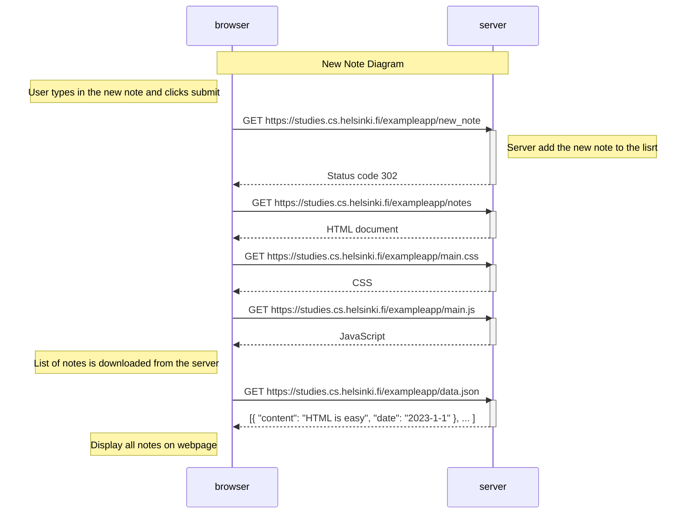

```mermaid
    sequenceDiagram
        participant browser
        participant server

        Note over browser, server: New Note Diagram

        Note left of browser: User types in the new note and clicks submit
        browser->>server: GET https://studies.cs.helsinki.fi/exampleapp/new_note
        activate server
        Note right of server: Server add the new note to the lisrt
        server-->>browser: Status code 302
        deactivate server
        browser->>server: GET https://studies.cs.helsinki.fi/exampleapp/notes
        activate server
        server-->>browser: HTML document
        deactivate server
        browser->>server: GET https://studies.cs.helsinki.fi/exampleapp/main.css
        activate server
        server-->>browser: CSS
        deactivate server

        browser->>server: GET https://studies.cs.helsinki.fi/exampleapp/main.js
        activate server
        server-->>browser: JavaScript
        deactivate server    

        Note left of browser: List of notes is downloaded from the server

        browser->>server: GET https://studies.cs.helsinki.fi/exampleapp/data.json
        activate server
        server-->>browser: [{ "content": "HTML is easy", "date": "2023-1-1" }, ... ]
        deactivate server   

        Note left of browser: Display all notes on webpage
```
